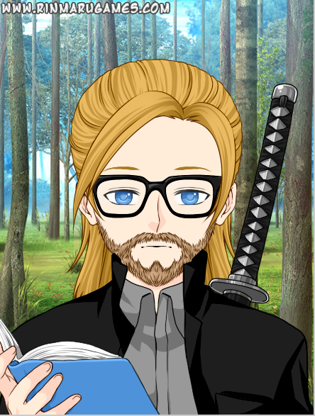

# Welcome

I am a scientist and freelance software developer located in
Regensburg, Bavaria. I'm enthusiastic about open source software,
Clojure(Script), and its application in game development and everyday
programming.

## Yes... but, why?

The idea behind this website is to keep me going. Having a blog of
some kind should give me the occasional push to work a bit on my
projects, hone my skills, learn something new.

Every random now and then, for example if I got some terribly obvious
insight, I'll post about some of the following fields of interest:

- statistics
- functional programming
- game programming
- using overly complex tools to achieve simple results

### Acknowledgements

This page is powered by [jekyll](https://jekyllrb.com), with the
[hack.css
theme](https://github.com/wemake-services/jekyll-theme-hackcss).  You
might have missed it, but the image is not an actual photo, but a
lookalike created with the [tools at rinmarugame](https://www.rinmarugames.com).
